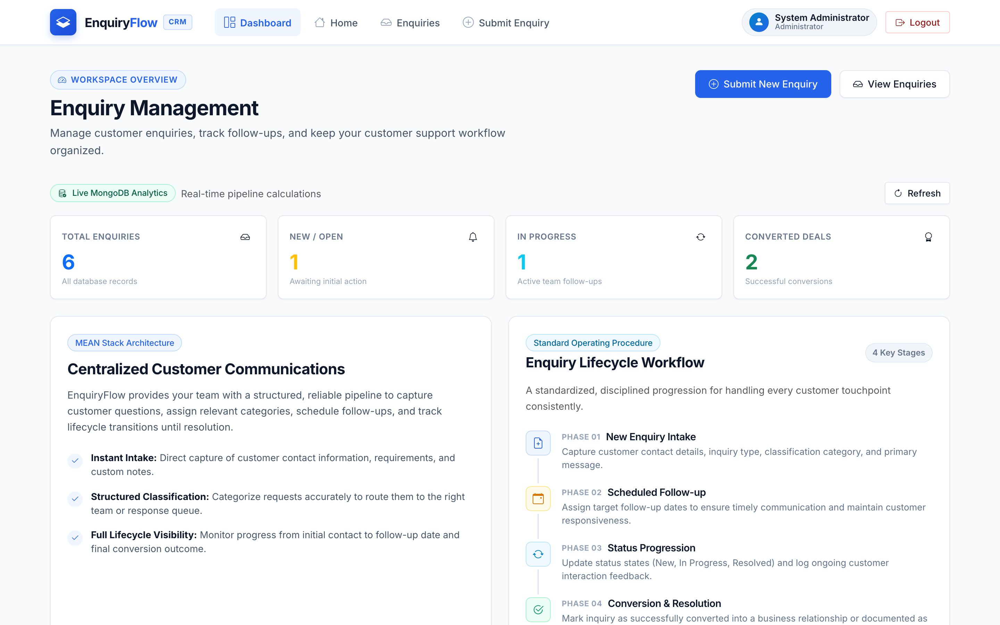
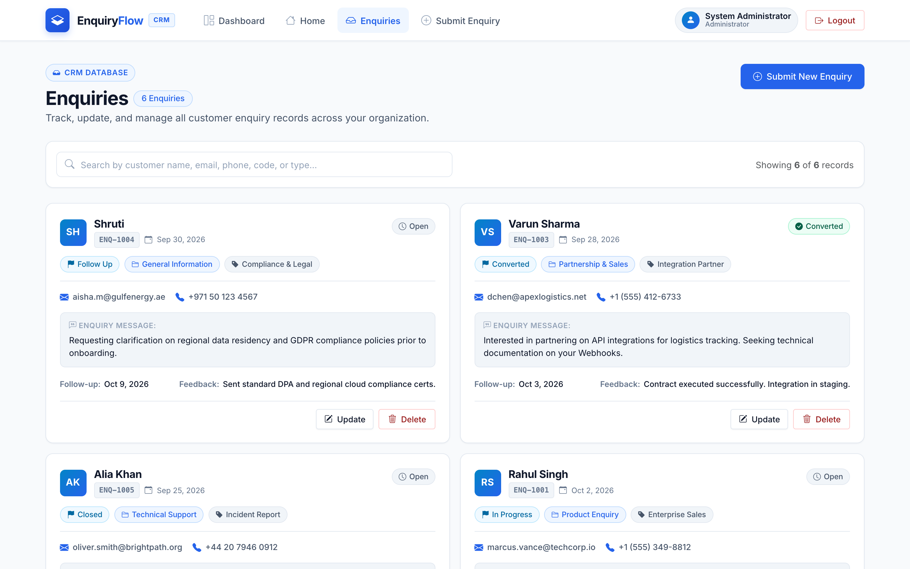
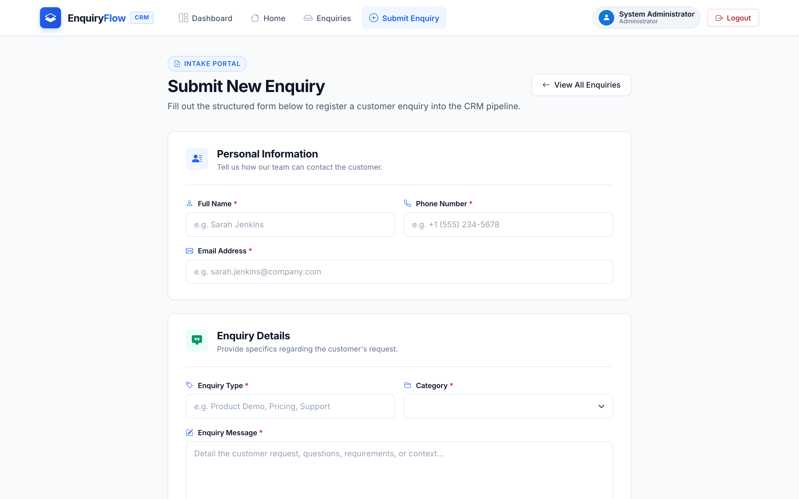
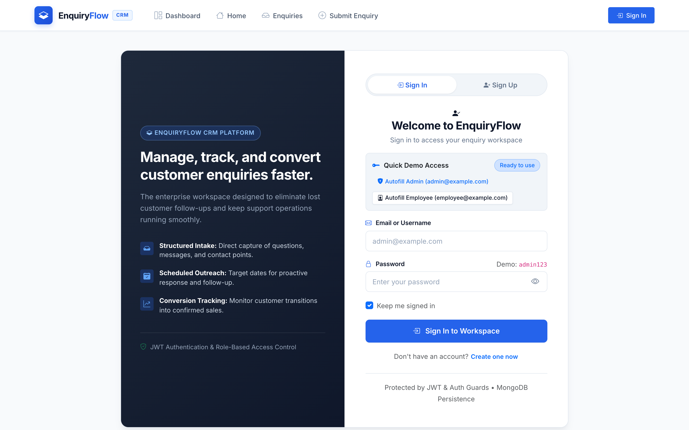
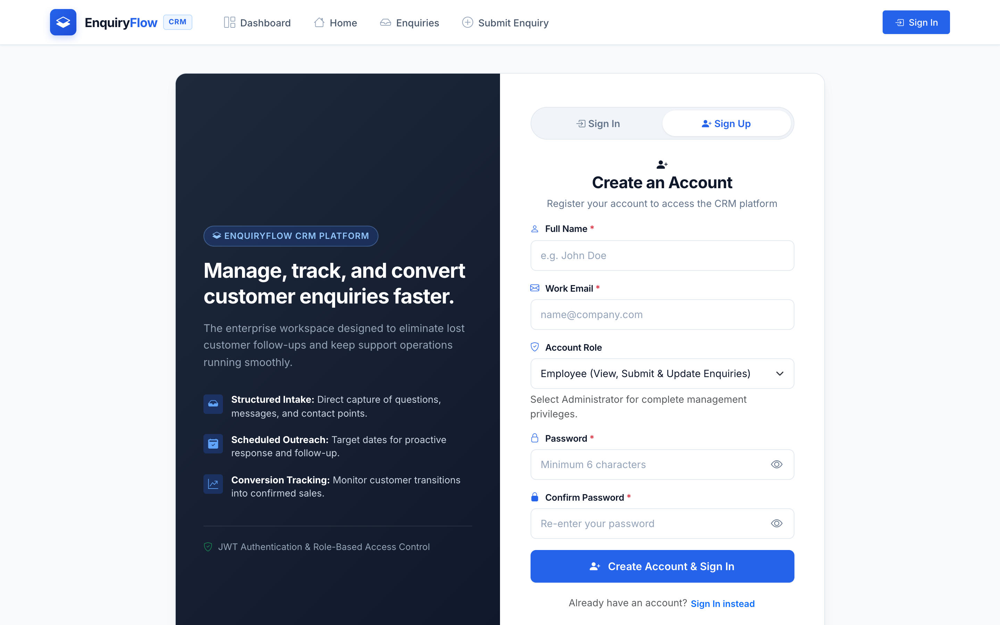

# 💼 EnquiryFlow — Enterprise MEAN Stack Enquiry Management System

> A production-ready, full-stack **MEAN** (MongoDB, Express.js, Angular 21, Node.js) Customer Relationship & Enquiry Management Application featuring secure JWT authentication, role-based access control (RBAC), database-driven analytics, and responsive CRM operations.

---

## 🌐 Live Demo & Deployment

- 🚀 **Live Web Application (Vercel)**: [https://enquiry-management-system-three.vercel.app/](https://enquiry-management-system-three.vercel.app/)
- 📡 **Live Backend REST API (Render)**: [https://enquiryflow-cnlu.onrender.com/api/health](https://enquiryflow-cnlu.onrender.com/api/health)

---

## 📋 Table of Contents

1. [Live Demo & Deployment](#-live-demo--deployment)
2. [Project Overview](#-project-overview)
3. [Screenshots](#-screenshots)
4. [Key Features](#-key-features)
5. [Technology Stack](#-technology-stack)
6. [Full-Stack Architecture & Monorepo Structure](#-full-stack-architecture--monorepo-structure)
7. [Prerequisites & Environment Configuration](#-prerequisites--environment-configuration)
8. [Quick Start & Local Setup](#-quick-start--local-setup)
9. [Database Seeding](#-database-seeding)
10. [Demo Credentials & Roles](#-demo-credentials--roles)
11. [REST API Documentation](#-rest-api-documentation)
12. [Angular Architecture & Best Practices](#-angular-architecture--best-practices)
13. [Security Implementations](#-security-implementations)
14. [Postman API Collection](#-postman-api-collection)
15. [Testing](#-testing)
16. [Author & Attribution](#-author--attribution)

---

## 🚀 Project Overview

**EnquiryFlow** is a modern, enterprise CRM application engineered to streamline the intake, tracking, assignment, and resolution of customer inquiries. 

The entire platform is organized as a clean **full-stack MEAN monorepo**:
- **MongoDB + Mongoose**: Cloud database persistence with structured schemas, validations, and aggregation pipelines.
- **Express.js + Node.js**: Scalable REST API with JWT authentication, role-based access control, security middleware (Helmet, CORS, Rate Limiting), and centralized error handling.
- **Angular 21**: High-performance frontend utilizing standalone components, two-way data-bound forms with validation, functional HTTP interceptors (`Bearer` token injection), route guards, and toast notifications.

---

## 📸 Screenshots

### 1. Analytics Dashboard & Live MongoDB Metrics


### 2. CRM Enquiry Management & Records


### 3. Structured Customer Intake Portal


### 4. Authentication & Quick Demo Access


### 5. Account Registration Portal


---

## ✨ Key Features

- 🔐 **Real JWT Authentication** — Secure login & registration generating signed JSON Web Tokens; unauthenticated requests are rejected with HTTP 401.
- 🛡️ **Role-Based Authorization (RBAC)** — Distinct permissions for **Admin** (full CRUD, category/status management, record deletion) and **Employee** (view, submit, and update enquiries).
- 📊 **Database-Driven Analytics** — Dashboard metrics computed dynamically via MongoDB aggregation pipelines (total, new, in-progress, converted, closed, conversion rate).
- 📝 **Complete Enquiry Lifecycle (CRUD)** — Submit new inquiries, search and filter across customer details, update status/follow-up notes via responsive modals, and delete records with confirmation safeguards.
- 🏷️ **Dynamic Categories & Statuses** — Relational references connecting enquiries to MongoDB `Category` and `Status` collections.
- ⚡ **Angular Functional HTTP Interceptor** — Automatically attaches `Authorization: Bearer <token>` to protected API requests and intercepts unauthorized responses.
- 🔔 **Toast Notification System** — Instant user feedback for submissions, edits, deletions, and network errors without browser alerts.
- 📱 **Mobile-First Responsive Design** — Clean Bootstrap 5 UI, offcanvas navigation, glassmorphism stat cards, and accessible forms with zero horizontal scrolling.

---

## 🛠️ Technology Stack

| Layer | Technology | Details |
|---|---|---|
| **Frontend** | Angular 21.1 | Standalone components, TypeScript 5.9, Vite dev engine |
| **Styling** | Bootstrap 5.3 & Icons | Responsive grid, utility classes, Bootstrap Icons |
| **Reactive State** | RxJS 7.8 | Observables, BehaviorSubjects, Subscriptions |
| **Backend** | Node.js & Express.js 4.21 | RESTful controllers, modular routes, middleware |
| **Database** | MongoDB & Mongoose 8.9 | Schemas, ObjectId references, aggregation, indexes |
| **Security** | JWT, bcryptjs, Helmet, CORS | Password hashing (salt rounds: 10), token verification, rate limiting |
| **Dev Tooling** | Concurrently, Nodemon, Vitest | Unified monorepo development workflows and unit testing |

---

## 🏗️ Full-Stack Architecture & Monorepo Structure

```text
Enquiry-Management-System/
│
├── frontend/                     # Angular 21 Single Page Application
│   ├── src/
│   │   ├── app/                  # Standalone components, services, models
│   │   ├── environments/         # Environment configuration (dev vs prod)
│   │   ├── index.html            # Main HTML entry point
│   │   └── styles.css            # Design system, variables, toast styling
│   ├── public/                   # Static assets
│   ├── angular.json              # Angular CLI config (Application builder)
│   ├── vercel.json               # SPA routing rewrite configuration for Vercel
│   ├── proxy.conf.json           # Local development proxy (/api -> 5001)
│   ├── tsconfig.json             # TypeScript configuration
│   └── package.json              # Frontend dependencies
│
├── backend/                      # Express.js REST API
│   ├── config/
│   │   └── db.js                 # Mongoose connection & auto-seeder
│   ├── controllers/              # Business logic & aggregation queries
│   ├── middleware/               # Auth, role guard, validation, error handler
│   ├── models/                   # Mongoose schemas (User, Enquiry, Category, Status)
│   ├── routes/                   # Express route definitions
│   ├── seed/
│   │   └── seed.js               # Database seeding script
│   ├── server.js                 # Express server entry point
│   ├── postman_collection.json   # Ready-to-import Postman v2.1 test suite
│   ├── .env.example              # Environment variables template
│   └── package.json              # Backend dependencies
│
├── package.json                  # Root monorepo workspace runner scripts
├── .gitignore                    # Monorepo git ignore rules
└── README.md                     # Project documentation
```

---

## ⚙️ Prerequisites & Environment Configuration

### Prerequisites
- **Node.js**: v18.0.0 or higher
- **npm**: v9.0.0 or higher
- **MongoDB**: A free MongoDB Atlas cluster connection string.

### Backend Environment Configuration
Inside `backend/`, copy `.env.example` to `.env` and configure your credentials:

```env
# Server Port (Default 5001 avoids macOS AirPlay collision on 5000)
PORT=5001

# MongoDB Connection String (Atlas URI)
MONGODB_URI=mongodb+srv://<username>:<password>@cluster0.yourdomain.mongodb.net/enquiryflow?retryWrites=true&w=majority

# JWT Secret Key
JWT_SECRET=super_secret_jwt_key_enquiry_flow_2026_production

# Client URL allowed for CORS
CLIENT_URL=http://localhost:4200
```

---

## 🚀 Quick Start & Local Setup

### 1. Install All Dependencies
From the repository root:
```bash
npm run install:all
```

### 2. Populate the Database (Seeding)
Once your `MONGODB_URI` is configured in `backend/.env`:
```bash
npm run seed
```

### 3. Start Frontend & Backend Concurrently
Run both services in one terminal from root:
```bash
npm run dev
```
- **Angular Frontend:** `http://localhost:4200`
- **Express Backend API:** `http://localhost:5001`
- **Health Check:** `http://localhost:5001/api/health`

---

## 👥 Demo Credentials & Roles

The seed script initializes two preconfigured accounts with hashed passwords:

| Role | Email | Password | Permissions |
|---|---|---|---|
| **Admin** | `admin@example.com` | `admin123` | Full access: View, create, update, delete enquiries, manage categories & statuses, view stats |
| **Employee** | `employee@example.com` | `employee123` | Operational access: View enquiries, submit new enquiries, update enquiries, view dashboard |

---

## 📡 REST API Documentation

Base URL: `http://localhost:5001/api` (proxied in Angular development via `/api`)

### 1. System Health
| Method | Endpoint | Access | Description |
|---|---|---|---|
| `GET` | `/api/health` | Public | System status and service health check |

### 2. Authentication (`/api/auth`)
| Method | Endpoint | Access | Description |
|---|---|---|---|
| `POST` | `/api/auth/login` | Public | Authenticate user, returns JWT and user profile |
| `POST` | `/api/auth/register` | Public | Register a new user account (Employee or Admin) |
| `GET` | `/api/auth/me` | Protected | Get current authenticated user profile |

### 3. Dashboard Analytics (`/api/dashboard`)
| Method | Endpoint | Access | Description |
|---|---|---|---|
| `GET` | `/api/dashboard/stats` | Public | Live counts (total, new, in-progress, converted, closed, conversion rate) calculated directly in MongoDB |

### 4. Enquiries (`/api/enquiries`)
| Method | Endpoint | Access | Description |
|---|---|---|---|
| `GET` | `/api/enquiries` | Protected | Fetch paginated enquiries with `?search=`, `?category=`, `?status=` |
| `GET` | `/api/enquiries/:id` | Protected | Retrieve single enquiry by MongoDB ObjectId |
| `POST` | `/api/enquiries` | Protected | Create a new enquiry (attaches `createdBy`) |
| `PUT` | `/api/enquiries/:id` | Protected | Update enquiry details, status, or follow-up |
| `DELETE`| `/api/enquiries/:id` | Admin Only | Delete an enquiry record from MongoDB |

### 5. Categories (`/api/categories`)
| Method | Endpoint | Access | Description |
|---|---|---|---|
| `GET` | `/api/categories` | Public | List all active categories |
| `POST` | `/api/categories` | Admin Only | Create new enquiry category |
| `PUT` | `/api/categories/:id`| Admin Only | Update category name / status |
| `DELETE`| `/api/categories/:id`| Admin Only | Remove category |

### 6. Statuses (`/api/statuses`)
| Method | Endpoint | Access | Description |
|---|---|---|---|
| `GET` | `/api/statuses` | Public | List all active lifecycle statuses |
| `POST` | `/api/statuses` | Admin Only | Create new status stage |
| `PUT` | `/api/statuses/:id` | Admin Only | Update status stage |
| `DELETE`| `/api/statuses/:id` | Admin Only | Remove status stage |

---

## 🅰️ Angular Architecture & Best Practices

- **Angular 21 Standalone Components**: Modern architecture without NgModule overhead.
- **Dependency Injection**: Services injected cleanly using `inject(MasterService)` and constructor DI.
- **HTTP Interceptor**: Functional `authInterceptor` configured in `app.config.ts`:
  ```typescript
  export const authInterceptor: HttpInterceptorFn = (req, next) => {
    const authService = inject(AuthService);
    const token = authService.getToken();
    if (token && req.url.includes('/api')) {
      req = req.clone({
        setHeaders: { Authorization: `Bearer ${token}` }
      });
    }
    return next(req);
  };
  ```
- **Type Safety**: Strongly-typed interfaces defined in `master.Model.ts` (`IEnquiry`, `IUser`, `ICategory`, `IStatus`, `IDashboardStats`, `IApiResponse`).
- **Toast Notifications**: `ToastService` using RxJS `Subject` for non-blocking alerts.
- **Development Proxy**: `frontend/proxy.conf.json` maps frontend `/api` calls directly to `http://localhost:5001`.

---

## 🔒 Security Implementations

1. **Password Hashing**: `bcryptjs` with salt round 10 before saving to MongoDB.
2. **JWT Authentication**: Signed JSON Web Tokens containing safe payload claims (`id`, `role`).
3. **Helmet**: Sets critical HTTP security headers preventing XSS and MIME-type sniffing.
4. **CORS Restrictions**: Configured to accept requests from the designated client origin (`CLIENT_URL`).
5. **Rate Limiting**: Protects authentication endpoints against brute-force attacks.
6. **Backend Data Validation**: All incoming requests are validated server-side independently of client-side validation.
7. **Protected Errors**: Centralized error middleware ensures stack traces are never exposed in production responses.

---

## 📮 Postman API Collection

A complete Postman v2.1 collection file is provided at:
```text
backend/postman_collection.json
```
**To test the API with Postman:**
1. Open Postman.
2. Click **Import** and select `backend/postman_collection.json`.
3. Run the **Login** request — the test script automatically captures the returned JWT token into the collection's `{{authToken}}` variable.
4. Execute any of the CRUD and analytics requests with authorization automatically applied!

---

## 🧪 Testing

Run frontend unit tests (Vitest):
```bash
npm test
```

Run Angular production build verification:
```bash
npm run build
```

---

## 👨‍💻 Author & Attribution

**Atharva Srivastava**  
Full Stack Developer  
Portfolio Project demonstrating enterprise full-stack design patterns with Angular 21, Express.js, and MongoDB Atlas.
